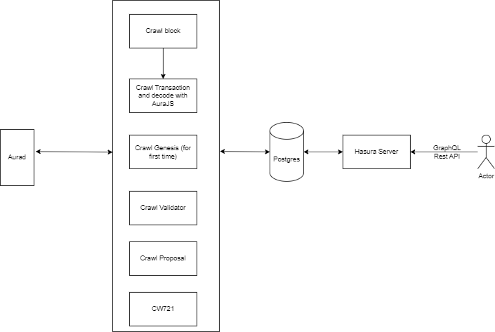

# Horoscope v2

Horoscope v2 is a next version of Horoscope, that is an indexing service for Cosmos-based blockchain. It crawls data from the blockchain and index it into Postgres. Based on the data, it can provide search functionality instead of querying data from LCD or RPC directly.

Currently, it supports network built by Cosmos SDK v0.45.1 or later. Supporting network:

- [Aura Network](https://github.com/aura-nw/aura)

> **Looking for Horoscope v1? The Horoscope v1 repository has been archived [`Horoscope v1`](https://github.com/aura-nw/Horoscope)**.

Horoscope v2 includes 2 main components:

- Crawler: crawl data from the blockchain and index it into Postgres
- Backend API: provide search functionality through Hasura service (with GraphQL and RestAPI)

## Overview Architecture

All services are small Node applications written in Typescript. The Node services are built using [Moleculerjs](https://moleculer.services/) framework with [template moleculer](https://github.com/aura-nw/moleculer-ts-base).
With crawler, we use [Bull](https://github.com/OptimalBits/bull/tree/master) to manage the queue of crawling.



## List services (currently)

- [**crawl-account**](./docs/services/crawl-account/crawl-account.md): get account auth and its balances
- [**crawl-block**](./docs/services/crawl-block/crawl-block.md): get block from network and insert to DB
- [**crawl-transaction**](./docs/services/crawl-transaction/crawl-tx.md): get transaction in a block and decode to readable
- [**handle-authz-msg**](./docs/services/crawl-transaction/handle-authz-tx-msg.md): handle authz message and decode to readable
- [**crawl-proposal**](./docs/services/crawl-proposal/crawl-proposal.md): get proposal and its status
- [**crawl-validator**](./docs/services/crawl-validator/crawl-validator.md): get validator and their power event, signing info
- [**crawl-genesis**](./docs/services/crawl-genesis/crawl-genesis.md): get state from genesis chunk
- [**crawl-cosmwasm**](./docs/services/crawl-cosmwasm/crawl-smart-contract.md): get codes and contracts
- [**CW721**](./docs/services/cw721/README.md): handle registed asset type CW721
- [**handle-vote**](./docs/services/handle-vote/handle-vote.md): parse vote message

## Database schema

You can view detail database schema [here](./docs/database_schema.md)

## How to run

Horoscope currently use private packet [aurajs](https://github.com/aura-nw/aurajs) to decode tx from Aura Network. To install aurajs, you must create a Personal Access Token has read package permission, put it to (xxx_xxx) on .npmrc file in root source code

```
@aura-nw:registry=https://npm.pkg.github.com/aura-nw
//npm.pkg.github.com/:_authToken=xxx_xxx
```

To install requirements (postgres, redis, hasura), use docker-compose:

```
docker-compose up
```

then start service

```
# create file env
cp .env.example .env

# run with moleculer cli
npm run dev
```

## Configuration

[Config Moleculer](.env.sample), refer [docs](https://moleculer.services/docs/0.14/configuration.html) to get detail configurations  
[Config list network](network.json) to config list network with LCD, RPC, database  
[Config chain](config.json) to setup job crawl and select chain id to crawl

## Scripts

- `npm run dev`: Start development mode (load all services locally with hot-reload & REPL)
- `npm run build`: Build .dist folder to start production mode
- `npm run start`: Start production mode (set `SERVICES` env variable to load certain services)
- `npm run lint`: Run ESLint
- `npm run test`: Run jest
